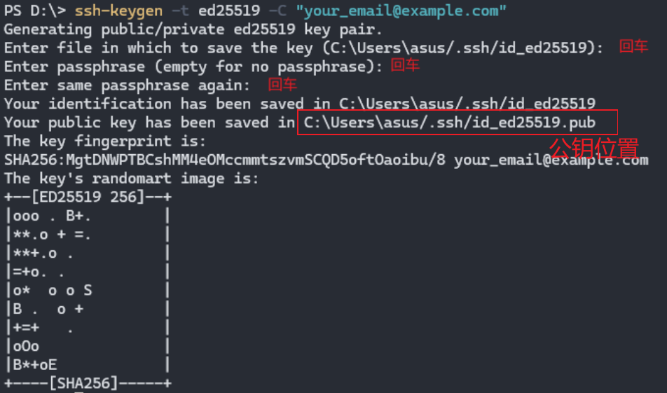
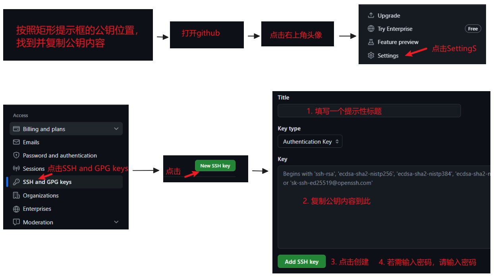

# Github部署的前提条件

## 前言

> 我们把静态网站部署到GitHub上，需要把静态网站项目推送到GitHub上。
>
> 而把项目推送到Github上，我们需要本机准备Git和配置SSH公钥到GitHub。

## Git准备

### 下载Git

> Git可以从官网和镜像源下载，但是官网下载太慢，下面给出镜像源下载方案。

[点击下载Git(通过华为云镜像)](https://mirrors.huaweicloud.com/git-for-windows/v2.45.0.windows.1/Git-2.45.0-64-bit.exe)

### 安装Git

1. 下载后打开Git安装包
2. 除了选择安装目录，其他的点击下一步即可(当然你也可以详细配置)

### 检查Git是否安装成功

打开命令行，输入`git --version`，出现提示信息说明安装成功。


### 配置全局用户和邮箱

> TODO

## 配置SSH公钥到GitHub

> 这里我们假设你之前没有配置过SSH，如果你之前配置过SSH(使用Github或者Gitee托管项目进行开发时)，我们相信这一步你已经完成了。

### 生成新的SSH密钥

在命令行输入`ssh-keygen -t ed25519 -C "your_email@example.com"`，邮箱换成自己的邮箱，然后敲击回车键三次。

  

### Github账户添加新的SSH密钥

1. 按照上图中矩形框所提示的公钥位置，找到公钥文件，复制公钥文件的内容
2. 点击右上角头像，向下找到Settings，点击进入设置中心
3. 点击左侧栏的SSH and GPG keys，点击New SSH key按钮，输入一个提示性的标题，把复制的公钥内容粘贴到Key中
4. 点击Add SSH key即可
5. 如果提示输入密码，输入密码即可



### 测试SSH连接

输入`ssh -T git@github.com`，出现如下提示说明SSH配置成功

```
Hi {username}! You've successfully authenticated, but GitHub does not provide shell access.
```

### 官方文档

[通过 SSH 连接到 GitHub - GitHub 文档](https://docs.github.com/zh/authentication/connecting-to-github-with-ssh)


