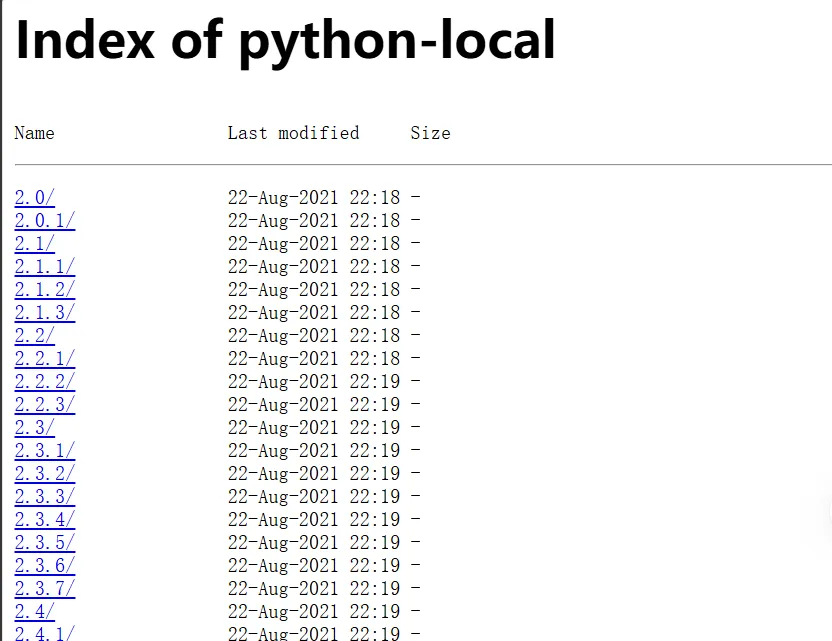
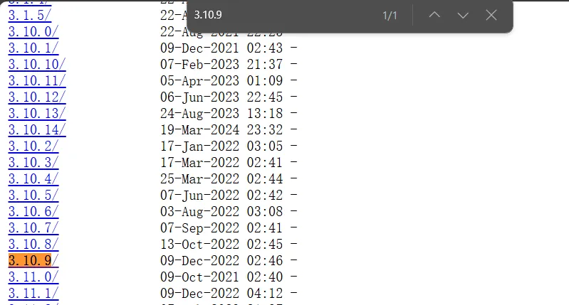
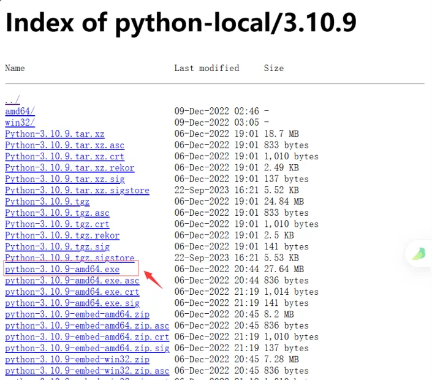
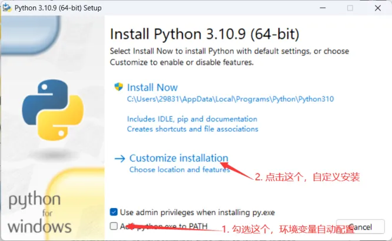
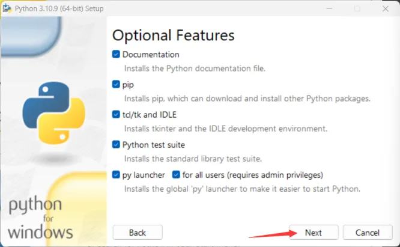
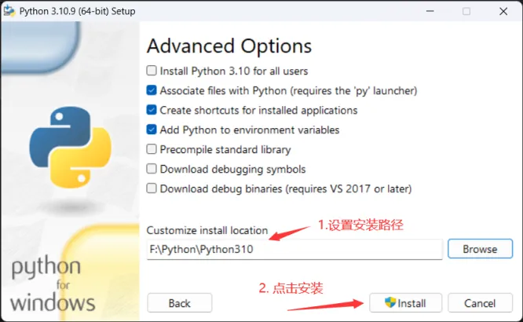
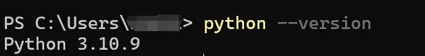

# Windows下载安装Python

## 下载安装包

1. 官网下载（下载速度比较慢，不推荐）
2. 镜像站下载（下载速度快，推荐，下面给出下载方案）

点击下面链接

https://mirrors.huaweicloud.com/python/

页面如下

 

找到3.10.9（可以使用CTRL + F直接搜索），页面如下。

下载其他的版本，同理

 

点击进入，选择下载python-3.10.9-amd64.exe即可

 

## 安装Python

下载完的安装包是这个样子的，双击打开

 

勾选Add python.exe to PATH,点击Customize installation

 

点击Next

 

设置你的Python的安装目录，然后点击安装。下载完之后关闭即可。



## 测试Python安装是否成功

打开命令行输入

```bash
python --version
```

显示类似于如下格式的信息，即表示下载成功


